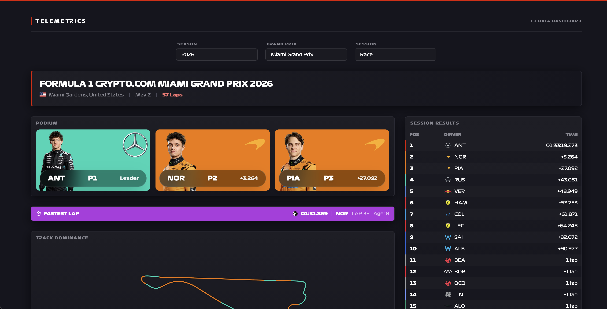

# Telemetrics - F1 Telemetry Visualization Dashboard

A TypeScript-powered React application for visualizing Formula 1 race telemetry data, including lap times, tyre strategies, track dominance, and session results.


## 🏎️ Features

- **Session Results** - Race and qualifying standings with gap to leader
- **Podium Display** - Top 3 finishers with driver photos and glassmorphism UI
- **Fastest Lap** - Fastest lap information with tyre compound and age
- **Track Dominance** - Visual representation of fastest driver per track segment (top 2 finishers)
- **Tyre Strategy** - Stacked bar chart showing tyre usage per driver
- **Lap Times Chart** - Interactive zoomable line chart of all lap times
- **Responsive Design** - Works on desktop, tablet, and mobile


*Full dashboard view showing all telemetry components*

## ⚠️ Data Availability & Limitations

### Timeline-Based Data Coverage

**Full Data (2018-2025):**
- ✅ Complete telemetry (speed, RPM, gear, position, DRS)
- ✅ Weather data (updated per minute)
- ✅ Lap timing and position data
- ✅ Tyre compound information
- ⏱️ Data available 30-120 minutes post-session

**Limited Data (Pre-2018):**
- ❌ No telemetry, weather, or position data
- ✅ Only basic session results (via Ergast API)

### Known Data Differences

**Tyre Compounds:**
- API provides **SOFT/MEDIUM/HARD** labels only (NOT C-numbers like C1-C5)
- The same physical compound (e.g., C3) may be labeled differently at different tracks
- Pirelli selects 3 compounds per race and labels them as Soft/Medium/Hard
- C-number mappings require external Pirelli pre-race announcements

**Sprint Qualifying Format:**
- 2021-2022: Race format (no Q1/Q2/Q3 segment times)
- 2024+: Qualifying format (includes Q1/Q2/Q3 segment times)
- FastF1 library handles format differences automatically

**API Changes:**
- Ergast API deprecated (end of 2024)
- Using Jolpica-F1 API as replacement: `https://api.jolpi.ca/ergast/f1`
- Configurable via `USE_JOLPICA_F1_API` environment variable

**Year-Specific Issues:**
- 2022: Some sessions had temporary server infrastructure issues (mostly resolved)
- Individual races may have quirks (e.g., 2024 São Paulo GP qualifying)
- Pipeline includes retry logic and error handling for known issues

> 💡 For detailed technical information about data discrepancies, see the inline documentation in `backend/scripts/data_transformers.py` and `fastf1_extractor.py`

## 🚀 Quick Start

### Prerequisites
- Node.js 18+ and npm
- A Supabase account (free tier works)
- Python 3.8+ (optional, only for data pipeline)

### 1. Clone the Repository

```bash
git clone https://github.com/yourusername/telemetrics.git
cd telemetrics
```

### 2. Setup Supabase

1. Create a new project at [supabase.com](https://supabase.com)
2. Go to **Project Settings → API** and copy:
   - Project URL
   - `anon` public key

### 3. Configure Frontend

```bash
cd frontend
npm install
cp .env.example .env
```

Edit `.env` and add your Supabase credentials:

```bash
VITE_SUPABASE_URL=https://your-project.supabase.co
VITE_SUPABASE_ANON_KEY=your-anon-key-here
```

### 4. Setup Database

In your Supabase SQL Editor, run:

```sql
CREATE TABLE telemetry_data (
  id BIGSERIAL PRIMARY KEY,
  year INTEGER NOT NULL,
  grand_prix TEXT NOT NULL,
  session TEXT NOT NULL,
  data_type TEXT NOT NULL,
  payload JSONB NOT NULL,
  created_at TIMESTAMP WITH TIME ZONE DEFAULT NOW(),
  updated_at TIMESTAMP WITH TIME ZONE DEFAULT NOW()
);

CREATE UNIQUE INDEX idx_unique_telemetry
  ON telemetry_data(year, grand_prix, session, data_type);

-- Enable RLS
ALTER TABLE telemetry_data ENABLE ROW LEVEL SECURITY;

-- Allow anonymous read access
CREATE POLICY "Allow anonymous read access"
  ON telemetry_data FOR SELECT USING (true);
```

> 💡 **Full schema**: See `backend/setup_database.sql` for complete database setup with all indexes and policies.

### 5. Run Development Server

```bash
npm run dev
```

Visit: http://localhost:5173/telemetrics/

### 6. Build for Production

```bash
npm run build
npm run preview  # Preview production build
```

## 🛠️ Tech Stack

### Frontend
- **React 18.3** with TypeScript
- **Vite 6** - Build tool & dev server
- **Tailwind CSS 3.4** - Styling
- **Chart.js 4.4** with plugins (zoom, datalabels)
- **Supabase JS Client** - Real-time database

### Backend & Data
- **Python 3.8+** with FastF1 library
- **Supabase (PostgreSQL)** - Database + REST API
- **Pandas & NumPy** - Data processing
- **JSONB** - Flexible telemetry storage

### Data Flow
```
FastF1 API → Python Pipeline → Supabase (JSONB) → React Frontend
   2018-2025     Transform      Real-time DB       Interactive UI
```

## 📊 Data Pipeline (Optional)

The pipeline fetches F1 telemetry from FastF1 (2018-2025) and stores it in Supabase for instant frontend access.

### Setup Python Environment

```bash
pip install -r requirements.txt
cd backend
cp .env.example .env
```

Edit `backend/.env` with your Supabase **service role** key:
```bash
SUPABASE_URL=https://your-project.supabase.co
SUPABASE_SERVICE_KEY=your-service-role-key-here  # NOT the anon key!
```

### Run Pipeline

**Test with single session (recommended first):**
```bash
cd backend/scripts
python main_pipeline.py --year 2024 --gp "Monaco" --session "Race"
```

**Full pipeline (all years 2018-2025):**
⚠️ Takes 6-8 hours, processes ~576 sessions
```bash
python main_pipeline.py
```

**Filter options:**
```bash
python main_pipeline.py --year 2024                  # Single year
python main_pipeline.py --gp "Monaco"                # Specific GP
python main_pipeline.py --session "Race"             # Session type
python main_pipeline.py --year 2024 --session "Race" # Combined
```

### Data Types Generated

Each session produces 7 data types for the frontend:

| Data Type | Component | Description |
|-----------|-----------|-------------|
| `session_results` | SessionResults | All driver standings |
| `podium` | Podium | Top 3 finishers with photos |
| `fastest_lap` | FastestLap | Fastest lap with tyre info |
| `get_session_data` | SessionInfo | Event metadata (location, date) |
| `track_dominance` | TrackDominance | Top 2 finishers' segment data |
| `tyres` | TyreStrategy | Tyre compounds per lap |
| `lap_chart_data` | LapsChart | All lap times for visualization |

> 📘 **Detailed docs**: See [PRD.md](PRD.md) for complete data schemas and transformation logic.

**Pipeline Troubleshooting:**
- **"Missing credentials"**: Check `backend/.env` has service role key (not anon key)
- **"Failed to load session"**: Some sessions lack data in FastF1, pipeline skips and continues
- **"Unique constraint violation"**: Data exists, pipeline auto-updates via upsert
- **Slow performance**: First run caches data locally, ~30-60s per session

## 🏗️ Project Structure

```
telemetrics/
├── frontend/
│   ├── src/
│   │   ├── components/         # React UI components (.tsx)
│   │   ├── hooks/              # Custom data hooks
│   │   ├── services/           # Supabase queries
│   │   ├── types/              # TypeScript interfaces
│   │   ├── utils/              # Formatters & constants
│   │   └── App.tsx             # Main component
│   ├── package.json
│   └── vite.config.ts          # Base path: /telemetrics/
├── backend/
│   ├── scripts/
│   │   ├── main_pipeline.py    # Orchestrator + CLI
│   │   ├── config.py           # Years, sessions, teams
│   │   ├── fastf1_extractor.py # FastF1 API wrapper
│   │   ├── data_transformers.py # Transform logic
│   │   └── supabase_uploader.py # DB uploads
│   ├── data/                   # JSON backups (auto-created)
│   └── setup_database.sql      # Database schema
├── requirements.txt            # Python dependencies
├── PRD.md                      # Full specifications
└── README.md                   # This file
```

## 🔧 Available Commands

**Frontend:**
```bash
npm run dev          # Start dev server
npm run build        # Build for production
npm run preview      # Preview production build
npm run lint         # ESLint check
npm run deploy       # Deploy to GitHub Pages
```

**Backend:**
```bash
python main_pipeline.py                # Full pipeline (2018-2025)
python main_pipeline.py --year 2024    # Single year
python main_pipeline.py --gp "Monaco"  # Specific Grand Prix
```

## 🌐 Deployment

### GitHub Pages

1. Update `vite.config.ts` with your repo name:
   ```typescript
   base: '/your-repo-name/'
   ```

2. Build and deploy:
   ```bash
   npm run build
   npm run deploy
   ```

Site will be available at: `https://username.github.io/your-repo-name/`

## 🐛 Troubleshooting

### Frontend Issues
- **Dropdowns empty**: Check `.env` has correct Supabase credentials, verify table has data
- **Charts not rendering**: Ensure data format matches schemas (see PRD.md), check Chart.js plugins installed
- **Build fails**: Run `npm install`, check TypeScript with `npx tsc --noEmit`

### Backend Pipeline Issues
- **Credentials error**: Use service role key in `backend/.env`, not anon key
- **Session load failures**: Some historical sessions lack FastF1 data, pipeline continues automatically
- **Slow performance**: FastF1 caches locally after first fetch (~30-60s per session)

## 📚 Documentation

- [PRD.md](PRD.md) - Complete Product Requirements
- [FastF1 Docs](https://docs.fastf1.dev/) - Data source API
- [Supabase Docs](https://supabase.com/docs) - Database documentation
- [Chart.js Docs](https://www.chartjs.org/docs/) - Visualization library

## 🤝 Contributing

1. Fork the repository
2. Create a feature branch: `git checkout -b feature/amazing-feature`
3. Commit changes: `git commit -m 'Add amazing feature'`
4. Push to branch: `git push origin feature/amazing-feature`
5. Open a Pull Request

## 📝 License

MIT License - See LICENSE file for details

## 🙏 Acknowledgments

- [FastF1](https://github.com/theOehrly/Fast-F1) - Excellent F1 data library
- [Supabase](https://supabase.com) - Amazing backend-as-a-service
- Formula 1 for the thrilling sport

---

**Built with ❤️ for F1 fans**
