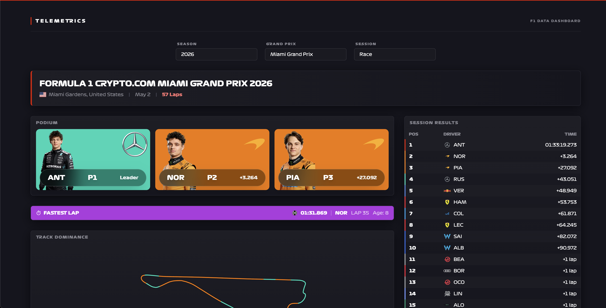
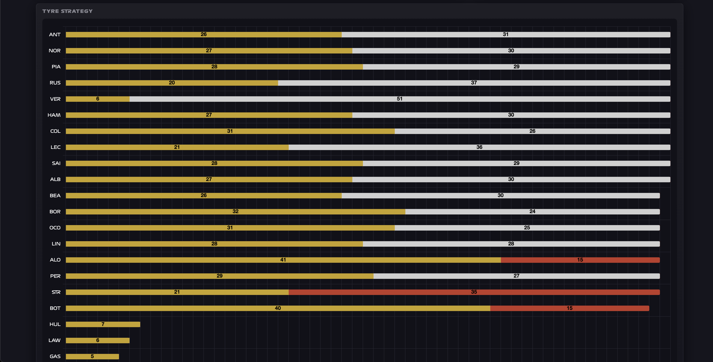
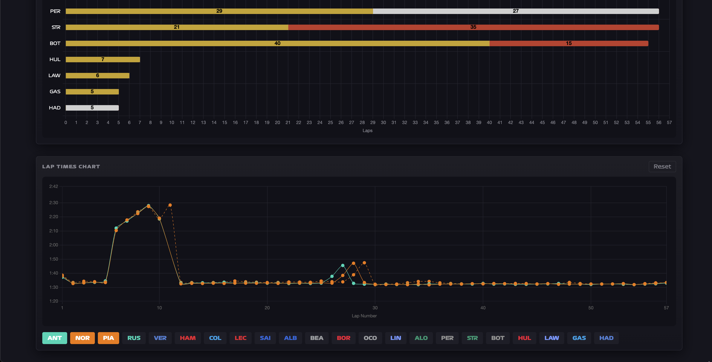

# Telemetrics

F1 telemetry dashboard covering every race weekend from 2018 to 2025. Select a year, Grand Prix, and session to explore:

- **Session Results** — full standings with gap to leader
- **Podium** — top 3 finishers with driver photos
- **Fastest Lap** — lap time, tyre compound, and tyre age
- **Track Dominance** — fastest driver per track segment across the top 2 finishers
- **Tyre Strategy** — stacked compound chart per driver
- **Lap Times** — interactive, zoomable chart of every lap

Built with React + TypeScript + Tailwind + Chart.js, backed by Supabase and a Python/FastF1 data pipeline.
